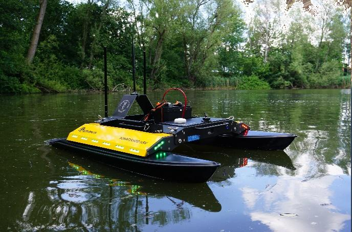
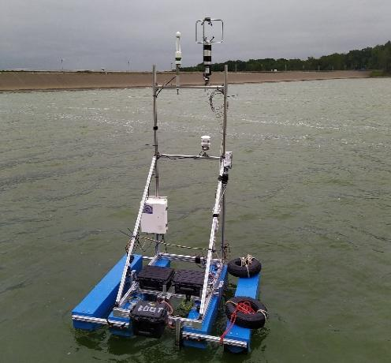
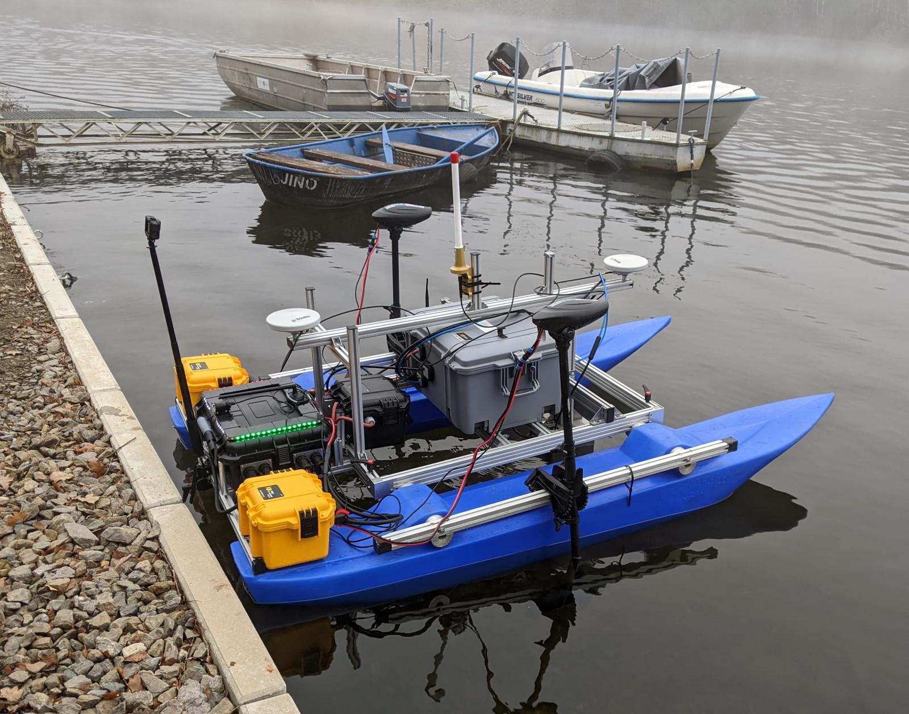
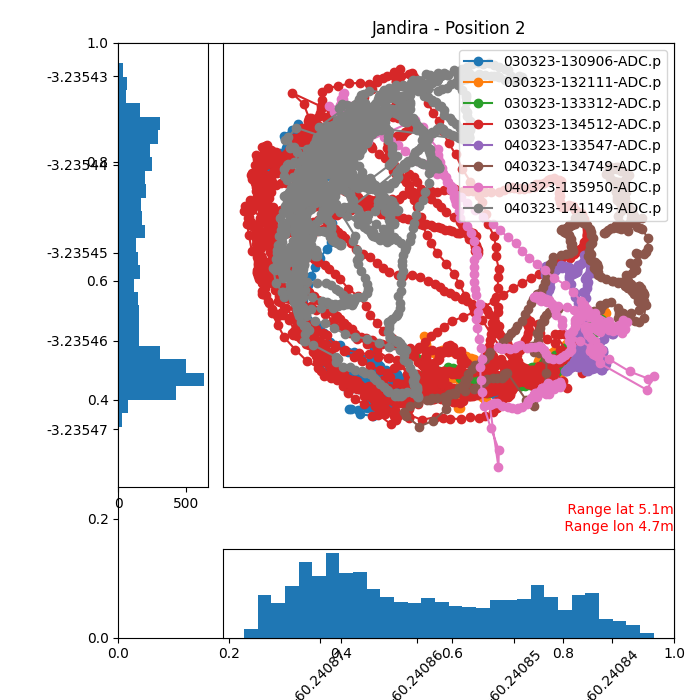
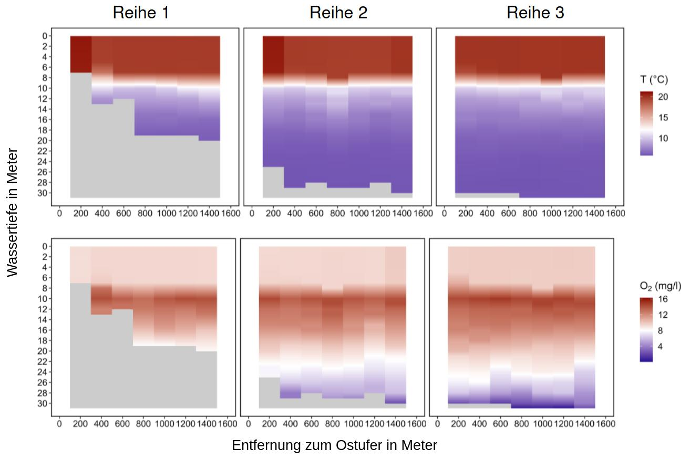
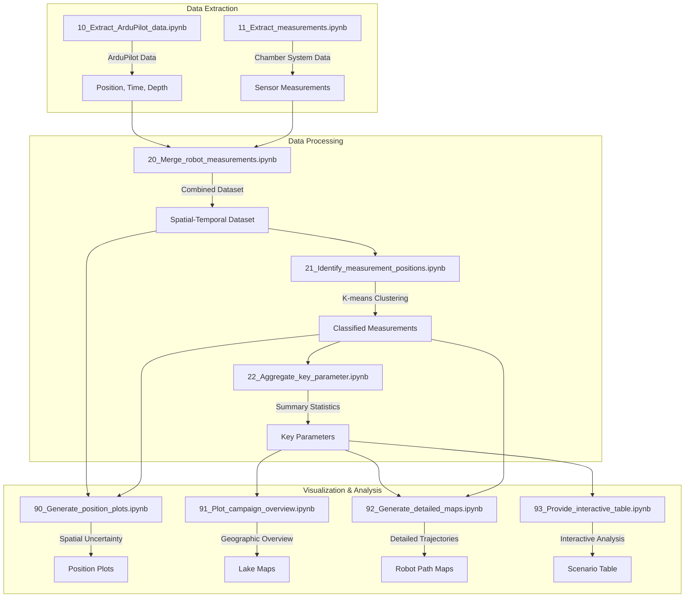

<!--
author:  Sebastian Zug
email:   sebastian.zug@informatik.tu-freiberg.de
version:  0.3.0
language: en
narrator: US English Female
import:   https://raw.githubusercontent.com/liaScript/mermaid_template/master/README.md
comment:  RoBiMo Trop Project Overview and Data Analysis

@style
.flex-container {
    display: flex;
    flex-wrap: wrap; /* Allows the items to wrap as needed */
    align-items: stretch;
    gap: 20px; /* Adds both horizontal and vertical spacing between items */
}

.flex-child { 
    flex: 1;
}

.flex-child2 { 
    flex: 3;
}

@media (max-width: 600px) {
    .flex-child {
        flex: 100%; /* Makes the child divs take up the full width on slim devices */
        margin-right: 0; /* Removes the right margin */
    }
}
@end
-->

[](https://liascript.github.io/course/?https://raw.githubusercontent.com/SebastianZug/RoBiMo_Trop_DataSet/refs/heads/main/presentation/liascript.md#1)

# Open data in live mode

<h5>
The importance of direct analyses and visualizations for the success of a measurement campaign
</h5>


<section class="flex-container">


<div class="flex-child" style="min-width: 250px">

> Prof. Dr. Sebastian Zug
>
> Gero Licht
>
> _TU Bergakademie Freiberg, Germany_
>
> __Freiberger Robotik Forum 2024__, 5.06.2024

</div>

<!-- class="flex-child2" style="min-width: 250px"-->


</section>

> This presentation is an Open Educational Resource (OER) and is licensed under [CC BY 4.0](https://creativecommons.org/licenses/by/4.0/deed.de). All included content may be freely used and is available at https://github.com/SebastianZug/RoBiMo_Trop_DataSet/blob/main/presentation/liascript.md.

## Swimming Robots in Freiberg

           {{0-1}}
***************************************

General Idea 
======================

> "Autonomous operation of aquatic robots for aggregating physical, chemical, and biological data in lakes (and rivers)."

<section class="flex-container">

<div class="flex-child" style="min-width: 300px">

Challenges:

+ obstacle detection in and above water
+ higly dynamic environments (e.g., wind, waves, currents)
+ "interested public" (e.g., swimmers, boats, etc.)
+ failure mode detection and recovery

</div>


<!-- class="flex-child2" -->


</section>

***************************************

           {{1-2}}
***************************************

History
====================

<!-- data-type=none -->
| Project                                                     | Partners                                                                      |  Duration   |
| :---------------------------------------------------------- | :---------------------------------------------------------------------------- | :---------: |
| AirGemm                                                     | Large interdisciplinary Team of partners from Bergakademie                    | 2019 - 2023 |
| RoBiMo\_Trop                                                | Prof. for Geochemistry and Earth System Science, TUBAF, Prof Jörg Matschullat |  2021 - 2024  |
| RoboBoatAssist                                              | Prof. for Virtual Reality and Multimedia, TUBAF, Prof. Bernhard Jung          | 2023 - 2024 |
| [Carri-on](https://tu-freiberg.de/soro/projekte/carri-on)   | Prof. for Biogeochemistry , TUBAF, Prof. Maximilian Lau                       |    2025     |
| [Submarine](https://tu-freiberg.de/sdc/forschung/SUBmarIne) | Scientific Diving Center, TUBAF, Dr. Thomas Grab                              | 2025 - 2028 |
| AseeDiZi                                                    | Chair of Applied Mathematics, BTU Cottbus-Senftenberg, Prof Michael Breuss    | 2025 - 2027 |





***************************************

## RoBiMo\_Trop - Project Overview

<section class="flex-container">

<!-- class="flex-child" style="min-width: 300px"-->
The RoBiMo Trop project represents a significant advancement in conducting biological monitoring in tropical environments. The project automates the data aggregation process by combining sensor technology, data collection methodologies, and analytical approaches to study ecological systems in challenging tropical conditions.

<!-- class="flex-child2" -->


</section>

### System setup & Data collection

```ascii
                                                     GUI (Website)
                                                          |
                                                          v
Measurement                                         +-----------+
Component        CO2 sensor    -------------------->| ESP32     |
                                  +----------+      |           |----> Download          
                Wind sensor    -->| Raspbery |      | Logging   |
                Humidity       -->| Pi       |<---->| Sensor    |
                Temperature    -->|          |      +-----------+
                                  |          |-----------------------> Logfiles (intended feature)
                                  +----------+

Autonomous                        +----------+    
Boat Control    Depth sensor   -->| ArduPilot|
Component                         | Pixhawk  |-----------------------> Download via ArduPilot
                                  |          |                         Mission planner
                                  +----------+

                                  +----------+
Obstacle        Laser scanner  -->| Raspberry|
Monitoring      Thermal camera -->| Pi       |-----------------------> ROS2bag File
Component       Camera         -->|          |
                                  +----------+
```

### The Critical Role of Live Data Analysis

Live data analysis stands as a cornerstone of the RoBiMo\_Trop campaign for several pivotal reasons:

+ **Quality Assurance**: Continuous monitoring of data quality ensures that any issues with sensors or data collection methods can be addressed promptly, minimizing the risk of collecting flawed data.
+ **Adaptive Research Strategies**: The ability to analyze data in real-time allows researchers to adapt their sampling strategies based on immediate findings, enhancing the relevance and efficiency of the research.




## Implementation



## Used Tools and Libraries

> We want to cover different researcher roles and skills as well as different environments (local, web-based, etc.) 

+ **Jupyter Notebooks** are used for data extraction, processing, and visualization

+ **hvPlot** provides local and web based visualizations https://hvplot.holoviz.org/

+ **Papermill** supports the orchestration of multiple notebooks https://github.com/nteract/papermill

> Let's take a closer view to the actual code -> https://github.com/SebastianZug/RoBiMo_Trop_DataSet

## Lessons learned for live hacking

+ Identify the expected outcomes and the personal skills of the involved team member before starting
+ Offer different levels of access to the code and data
+ Notebooks are great for prototyping ... but ugly for collaboration
+ Be prepared for areas without internet access
+ Automate processes as much as possible

> A heartfelt thank you to the RoBiMo\_Trop team from the different faculties of TUBAF! This interdisciplinary "hackathon" was a valuable learning experience for agile software development.